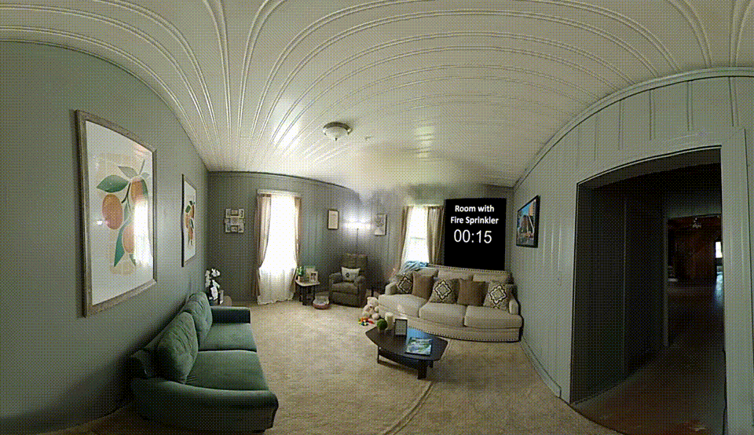

#  Fire & Smoke Detection using YOLO 8m

A computer vision project for detecting **fire and smoke in video streams** using a custom-trained YOLO object detection model.

The project contains a trained model, inference script, sample test video, and example detection results. The goal is to provide a simple and reproducible starting point for real-time fire and smoke detection using Python and OpenCV.

---

## Features

- Fire and smoke detection using YOLO
- Video-based inference using OpenCV
- Custom-trained detection model
- Bounding-box visualization with confidence scores
- Simple Python inference pipeline
- Sample test video included
- Trained model included for immediate testing

---

## Project Structure

fire_smoke_detection/
│
├── best.pt                  # Trained YOLO model
├── README.md
├── requirements.txt
├── .gitignore
├── .gitattributes
│
├── scripts/
│   └── trial1.py            # Detection/inference script
│
├── videos/
│   └── vid3.mp4             # Sample test video

## Detection Demo

The following recording shows the trained model performing fire and smoke detection on a sample video.

## Detection Results

### Fire Detection

### Smoke Detection

### Fire and Smoke Detection

## Model

The project uses a custom-trained YOLO object detection model.

The trained weights are provided as:

best.pt

The model is used to identify fire and smoke objects within video frames and return bounding boxes with confidence scores.

## Requirements

The project requires Python and the packages listed in:

requirements.txt

Install the dependencies with:

pip install -r requirements.txt

## Running the Detection

Clone the repository:

git clone https://github.com/ABIMGOOD/fire_smoke_detection.git

Navigate into the project:

cd fire_smoke_detection

Install the dependencies:

pip install -r requirements.txt

Run the detection script from the project root:

python scripts/trial1.py

The script loads the trained model:

model = YOLO("best.pt")

and opens the sample video:

cap = cv2.VideoCapture("videos/vid3.mp4")

## Sample Test Video

A sample test video is included in:

videos/vid3.mp4

The video can be used to test the detection pipeline after installing the required dependencies.

## Sample Detection Results

Example outputs from the trained model are shown below.

Fire Detection

Smoke Detection

Fire and Smoke Detection

## How It Works

The detection pipeline is based on the following process:

Input Video
     │
     ▼
Read Video Frame
     │
     ▼
YOLO Detection Model
     │
     ▼
Fire / Smoke Detection
     │
     ▼
Bounding Boxes + Confidence
     │
     ▼
Display Detection Result

Each video frame is passed through the trained YOLO model. When fire or smoke is detected, the model returns the predicted class, bounding box, and confidence score.

## Detection Output

The system produces bounding boxes around detected objects and displays the predicted class and confidence.

Example:

Fire  0.91
Smoke 0.84

The exact confidence values depend on the input image/video and model predictions.

## Use Cases

Potential applications include:

Fire detection in surveillance cameras
Industrial safety monitoring
Warehouse monitoring
Building surveillance
Remote-area monitoring
Early warning systems
Robotics and autonomous monitoring platforms

## Limitations

This project is intended as a computer vision prototype and should not be considered a certified fire safety system.

Detection performance can be affected by:

Lighting conditions
Camera quality
Distance from the fire or smoke
Occlusion
Environmental conditions
Smoke appearance and density
False positives caused by objects with similar visual characteristics

Further validation on diverse real-world datasets would be required before deployment in safety-critical environments.

## Future Improvements

Possible improvements include:

Real-time webcam inference
Real-time RTSP/IP camera support
Improved model accuracy through additional training data
False-positive reduction
Model evaluation using precision, recall and mAP
Edge deployment on Raspberry Pi or other embedded platforms
Automated fire/smoke alerts
Integration with robotics and surveillance systems
Dashboard for monitoring multiple camera feeds

## Project Status

Current status: Working prototype

The trained model and inference pipeline are available for testing using the included sample video.

👤 Author

ABIMGOOD

GitHub:
https://github.com/ABIMGOOD

 License

This project is provided for educational and research purposes.
